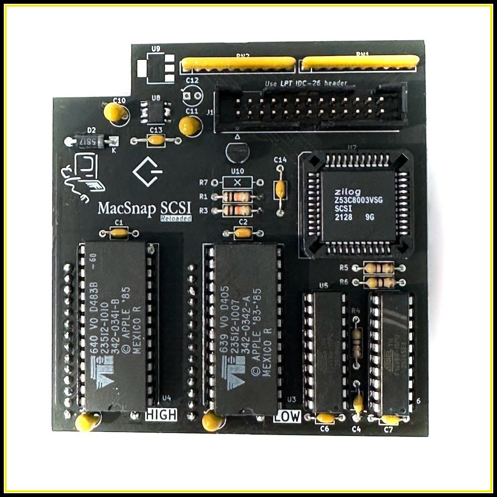

# MacSnap SCSI

The MacSnap SCSI is an upgrade for the Macintosh 512K(e) It includes a SCSI controller and is designed to plug into the ROM slots
It was developed by Dove Computer Corporation. This is a REcreation with a few improvements.

 
 

	

 
 
 
 

## [![Button Documentation]][Documentation]
- Kikad Files are located [here](EDA/REloaded), as well with building instructions for the REloaded board
- PLD files are located [here](PLD)
- Gerbers files are in the [release section](https://github.com/demik/MacSnap-SCSI/releases/download/v2.1/MacSnap_SCSI_Reloaded_2.1.zip)
- Schematic in PDF form is [here](https://github.com/demik/MacSnap-SCSI/blob/main/EDA/REloaded/MacSnap%20SCSI.pdf)

<!----------------------------------------------------------------------------->

[Documentation]: https://github.com/demik/MacSnap-SCSI/tree/main/EDA/REloaded/README.md

<!-------------------------------[ Buttons ]----------------------------------->

[Button Documentation]: https://img.shields.io/badge/Documentation-FFDD21?style=for-the-badge&logoColor=white&logo=BookStack
